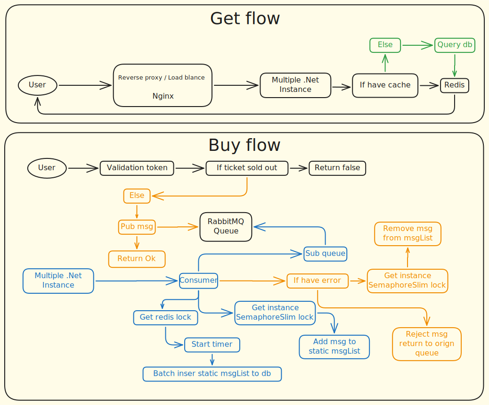

## 設計理念

- **主要目標**：這個專案的目的是研究系統在高併發情境下所面臨的挑戰，並尋找相應的解決方案。
- **高併發應對**：為了滿足高併發需求，我們採用了主從式資料庫架構，並引入 RabbitMQ 進行消息隊列管理，減輕主線程的壓力。同時，使用 Redis 作為快取和分布式鎖，提升資料存取速度和狀態管理的效率，並透過 Nginx 進行負載均衡，增強系統的擴展性和穩定性。

### 擴展策略

- **容器化部署**：使用 Docker 進行容器化建置，方便系統的水平擴展。
- **負載均衡**：利用 Nginx 進行負載平衡和反向代理，統一管理請求，提升併發處理能力。
- **資料庫主從架構**：採用主從式資料庫設計，簡化資料庫的水平擴展。

### 原則與模式

- **SOLID 原則**：遵循 SOLID 原則，確保代碼的高內聚、低耦合，提升系統的可維護性。
- **讀寫分離架構**：採用讀寫分離架構，明確劃分職責，提升系統的可讀性和擴展性。
- **依賴注入 (Dependency Injection)**：使用 .NET 內建的 DI 容器，增強系統的模組化和可測試性。

## 使用技術與選型理由

- **C# (.NET)**：用於開發核心後端邏輯。
- **Entity Framework Core**：透過 ORM 與資料庫交互。除特定業務情境外，ORM 的效能在大多數場景已相當優秀，因此大部分情況下使用 EF Core，少數情境下使用 EF Core Extension 和原生 SQL 來實現。
- **JWT (Json Web Token)**：使用 JwtBearer 管理用戶狀態，透過長期（用於更新）和短期（用於驗證）的 Token 組合，提升系統的安全性，降低 Token 被劫持的風險。
- **依賴注入 (Dependency Injection)**：使用 .NET 內建的 DI 容器，實現服務的自動註冊和解析，提升模組之間的解耦性。
- **NLog**：用於日誌管理，提供結構化的日誌記錄，並與 MSSQL 整合，將結構化的日誌寫入資料庫。
- **MSSQL**：與 C# 和 EF Core 整合良好，透過 Always On Group 設定主從式架構，適合作為系統的關聯式資料庫。
- **MediatR (CQRS 架構)**：實現讀取與寫入的分離，提升代碼的可讀性和維護性。結合主從式資料庫架構，優化資料庫的讀寫效能，支持系統的水平擴展。
- **RabbitMQ**：實現消息累積並批量處理（發布/訂閱模式），減輕主線程負擔，確保系統在高併發下的穩定性。
- **Redis**：除了用於快取外，還使用分布式鎖提供多實例情境下的狀態管理，Lua 腳本則提供高併發下的原子性和執行緒安全。
- **Docker**：進行容器化部署，避免開發環境污染，確保不同工具之間的環境一致性，並解決部分工具在 Windows 上的相容性問題。
- **Nginx**：作為反向代理和負載均衡器，提升系統的併發處理能力，分擔流量，確保高可用性。

### 未完成部分

- **微服務與 Kubernetes 管理**：
    - 計劃將各個功能模組拆分為微服務，並使用 Kubernetes (K8S) 統一管理，以實現：
        - **自動擴展**：根據流量動態調整服務實例數量，確保系統穩定性。
        - **故障恢復**：透過 K8S 的健康檢查和自動重啟機制，提升系統的容錯能力。
        - **無縫部署**：實現零停機的版本更新，保障系統的高可用性。
    - 但詢問了一些前輩的意見後發現，有採用 K8S 的公司似乎傾向由專人負責，因此暫時不以此為目標。
- **前端部分**：
    - 因為不是本專案的主要訴求，雖已建置前端環境，但尚未投入時間進行實作。
- **單元測試**：
    - 曾嘗試進行單元測試，但由於專案頻繁重構，維護測試的時間成本過高，最終決定暫停維護測試。

由於已到達規劃的待業時間，決定將專案告一段落並開始收尾。未來有機會時，再視情況完善此專案。

---

## 解決的問題

### 購票請求的效能瓶頸

- **流程描述**：使用者傳入身份識別和請求資料 → Nginx 分發請求 → 後端接收並判斷是否有足夠的票可供購買 → 返回購買失敗或進入支付頁面，並將請求放入隊列等待 `Consumer` 處理。（支付流程未實作，只要進入支付頁面，併發的問題就降低了，因為進入的人數是可預期的，且容許的處理時間也更長。）

- **問題發生點**：在購買請求傳入後，判斷有可用票並放入隊列的步驟遇到了效能問題。

- **初始解決方案**：
    - 為了滿足多個後端實例同時運行，且避免超賣情況，採用了異步鎖來確保同一時間只有一個執行緒進入關鍵區域，其餘請求需等待一定時間後重試。
    - 但當同時等待的執行緒超過一定數量時，會消耗大量 CPU 資源，最終導致錯誤。

- **優化措施**：
    - 為了避免執行緒在相同時間不停重試，將重試機制改為在固定時間區間內隨機取得等待時間，雖然減輕了 CPU 壓力，但效率仍然不高。
    - 最終將異步鎖改為使用 Redis 的 Lua 腳本進行票數判斷，利用 Lua 的單執行緒原子特性，避免不同實例需要同時維持異步鎖的問題，減少頻繁的等待和重試。
    - 採用 Lua 腳本後，判斷票數是否足夠的效能大幅提升。

- **新的瓶頸與解決**：
    - 在增加測試量後，發現將消息放入 RabbitMQ 時出現新的瓶頸：每次放入消息都需要建立一個新的連接，導致高併發下效能降低。
    - 為了解決此問題，引入了連接池（Connection Pool），在後端啟動時預先建立連接池，供服務重複使用，成功提高了效能。

### 大量資料插入的效能瓶頸

- **問題描述**：使用 JMeter 進行壓力測試時，當資料量超過 2000 筆，資料庫的 CPU 使用率長時間保持在高位，導致處理延遲。

- **原因分析**：發現插入資料時使用了 EF Core 的 `Add` 和 `AddRange` 方法，這些方法並非為批量插入設計，會為每一筆資料生成獨立的 SQL 與資料庫交互。

- **解決方案**：改用 EF Core Extension 進行批量插入，並在插入前將資料分批，每次插入 1000 筆，避免資料庫的 RAM 使用率過高，提升處理速度。

### JMeter 壓力測試的瓶頸

- **問題描述**：最初在 Windows 上進行壓力測試時，本機與 Docker Engine 的 TCP/IP 連接存在限制，最多只能同時開啟約 200-230 個 TCP 連接，無法驗證高併發情境下系統的極限。

- **解決方案**：嘗試將 JMeter 加入 Docker Network，而非使用本機進行測試，成功突破了連接數量的限制。雖然在同一台機器和網路下進行壓力測試的參考價值有限，但在資源有限的情況下，這是相對合理的方案。

---

## JMeter 測試結果

| 樣本數量 | 平均值 | 最小值 | 最大值 | 標準差 | 錯誤百分比 | 吞吐量 |
| --- | --- | --- | --- | --- | --- | --- |
| 1000 | 185 | 1 | 471 | 132.07 | 0.000% | 21.72622 |
| 5000 | 805 | 1 | 1965 | 608.87 | 0.000% | 46.18255 |
| 10000 | 2057 | 1 | 4250 | 1557.47 | 0.000% | 48.26573 |
| 15000 | 8560 | 1 | 14706 | 3329.97 | 0.000% | 156.34935 |
| 20000 | 37735 | 0 | 81382 | 31545.14 | 0.000% | 69.23625 |
| 24000 | 62327 | 52356 | 73613 | 5712.08 | 0.000% | 10.78896 |
| 28000 | 45406 | 16184 | 86741 | 17419.33 | 0.000% | 960.00000 |
| 30000 | 128098 | 8188 | 203419 | 73710.07 | 5.897% | 76.58453 |

### 測試結果說明

以上表格展示了不同樣本數量下的購票請求效能測試結果。這些測試是在將執行緒準備好後，同時送出請求的條件下進行的。從表中可以看出，隨著樣本數量的增加，平均響應時間和標準差也隨之增加，顯示出系統在高併發情境下的效能瓶頸。在樣本數量達到 30000 時，開始發生了錯誤，目前系統的極限約在每秒 28000 個請求。
